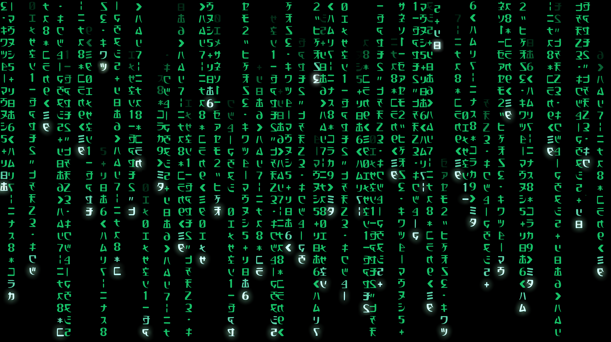

# AITool-Phishing (Edición de Alto Poder)

**AITool-Phishing** es un script de Python 3 que automatiza la instalación de las herramientas más potentes y modernas para auditorías de seguridad y simulaciones de phishing. Este proyecto ha sido completamente refactorizado para ser más seguro, robusto y fácil de usar, enfocado en un uso ético y educativo.



## Advertencia de Uso Ético

Este programa instala herramientas que, si bien son utilizadas por profesionales de la ciberseguridad para auditorías, pueden ser empleadas con fines maliciosos. El uso de estas herramientas para atacar sistemas sin consentimiento explícito es **ilegal** y puede acarrear graves consecuencias legales. Al utilizar este script, usted acepta hacerlo únicamente con **fines educativos y éticos**.

## Características

- **Animación de Inicio Estilo Matrix**: Una bienvenida visual para una experiencia inmersiva.
- **Instalador Automatizado**: Descarga e instala las dependencias de cada herramienta con un solo comando.
- **Verificación de Dependencias**: Comprueba si tienes `git`, `go` y privilegios de `root` antes de empezar.
- **Código Moderno y Seguro**: Escrito en Python 3, utilizando `subprocess` para la ejecución segura de comandos.
- **Menú Descriptivo**: Entiende qué hace cada herramienta antes de instalarla.

## Kit de Herramientas de Alto Poder

Este script instala las siguientes herramientas, consideradas estándar en la industria y altamente efectivas:

- **Gophish (Phishing Framework)**: Plataforma profesional para campañas de phishing empresariales, con seguimiento y análisis detallado.
- **Zphisher (Modern & Stable)**: La evolución de herramientas como Shellphish, con más de 30 plantillas y túneles actualizados (Cloudflare, Ngrok).
- **Wifimosys (WiFi Phishing)**: Permite realizar ataques de "Evil Twin" para capturar contraseñas WPA/WPA2 mediante un punto de acceso falso.
- **AdvPhishing (Advanced)**: Herramienta avanzada con plantillas para capturar códigos OTP y evadir la autenticación de dos pasos (2FA).
- **Modlishka (Reverse Proxy)**: Potente proxy inverso que permite interceptar sesiones en tiempo real y automatizar el bypass de 2FA.


## Compatibilidad

- **Sistema Operativo**: Linux (Debian/Ubuntu recomendado para una instalación de dependencias sin problemas).
- **Python**: Python 3.x.
- **Dependencias**: `git`, `golang` (para Gophish y Modlishka).

## Instalación

1.  **Clonar el repositorio:**
    ```bash
    https://github.com/Kuaker123/TareaRossemberg
    ```

2.  **Navegar al directorio:**
    ```bash
    cd TareaRossemberg
    ```

3.  **Ejecutar el script con privilegios de root:**
    ```bash
    sudo python3 AItool_Phishing.py
    ```

## Créditos

- **Creador**: Ulises Garcia
- **Refactorización y Mejoras**: Gemini
